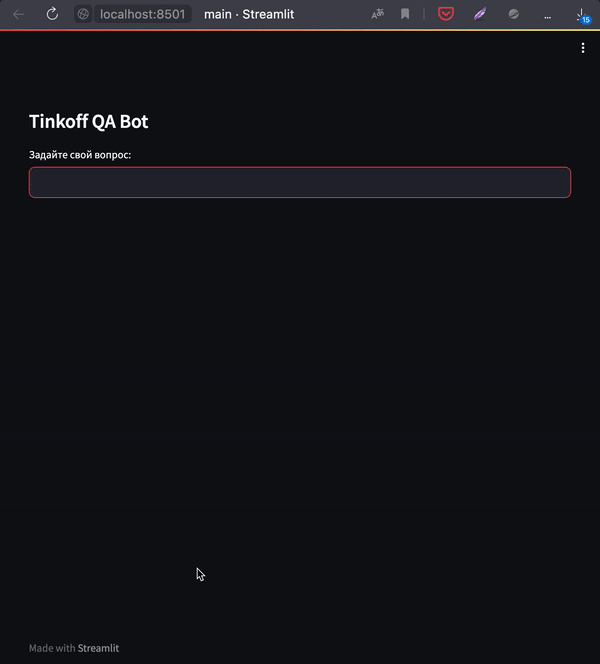

## Tinkoff QA-bot

Это проект вопросно-ответного бота по FAQ Тинькофф.

Приложение реализовано с использованием ChatGPT и внешних данных для него (база FAQ вопросов).



### Как запустить?

0. Подготовить Python окружение, согласно [`requirements.txt`](requirements.txt)

1. Первым делом нам нужно собрать индекс из документов, по которым мы будем искать. Для этого нужно запустить ноутбук [`crawling.ipynb`](crawling.ipynb).

2. Запустить приложение `streamlit`:
```
streamlit run main.py
```
